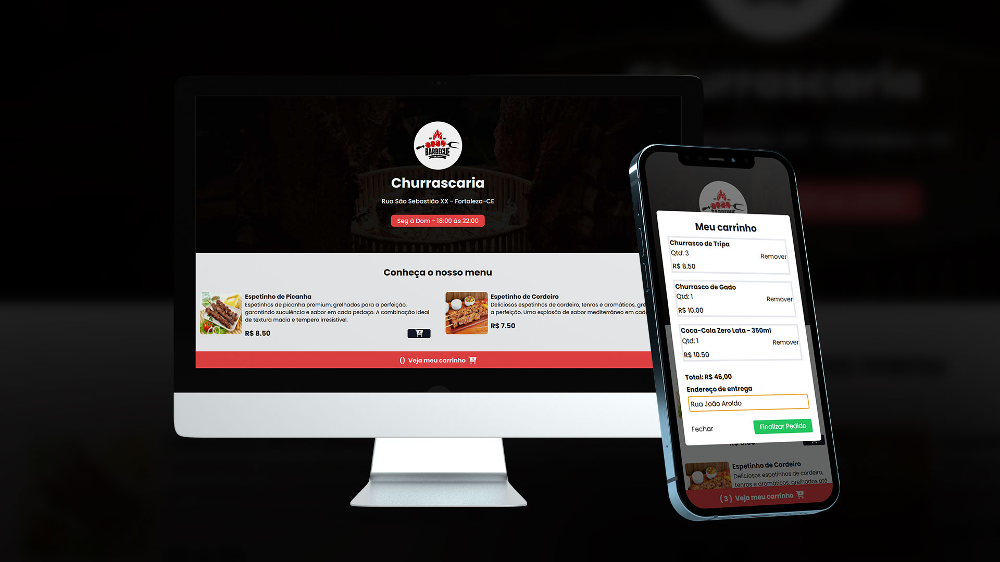

<h1 align="center"> Cardápio - Churrascaria</h1>

  <a href="#-tecnologias">Tecnologias</a>&nbsp;&nbsp;&nbsp;|&nbsp;&nbsp;&nbsp;
  <a href="#-projeto">Projeto</a>&nbsp;&nbsp;&nbsp;|&nbsp;&nbsp;&nbsp;
  <a href="#-layout">Layout</a>&nbsp;&nbsp;&nbsp;|&nbsp;&nbsp;&nbsp;
  <a href="#memo-licença">Licença</a>

  

 

  

## 🚀 Tecnologias

Esse projeto foi desenvolvido com as seguintes tecnologias:

- HTML
- JavaScript
- Tailwind CSS
- Toastify JS
- Git e Github
- Figma

## 💻 Projeto
- [Acesse o projeto finalizado, online](https://ravycarvalhodeveloper.github.io/cardapio/)

## 🔖 Layout

Layout desenvolvido por Sujeito Programador.

Cardápio Online.

